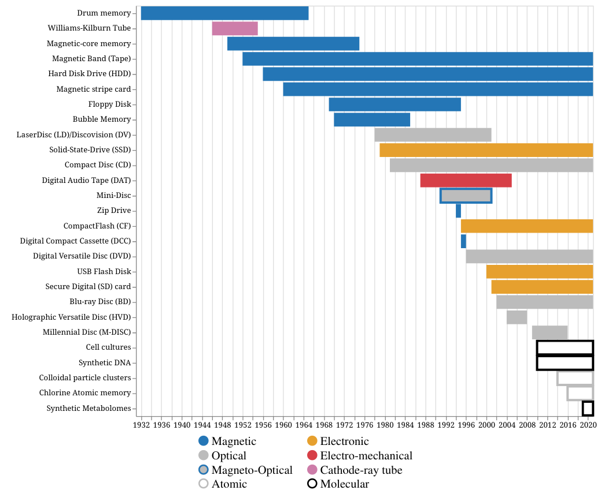

# The Visual Story of Data Storage: From Storage Properties to User Interfaces (TVSDS)

Supplementary material for the paper ***"The Visual Story of Data Storage: From Storage Properties to User Interfaces"*** by Aleksandar Anžel, Dominik Heider, and Georges Hattab.

Please cite the paper as:
```
@article{ANZEL20214904,
title = {The visual story of data storage: From storage properties to user interfaces},
journal = {Computational and Structural Biotechnology Journal},
volume = {19},
pages = {4904-4918},
year = {2021},
issn = {2001-0370},
doi = {https://doi.org/10.1016/j.csbj.2021.08.031},
url = {https://www.sciencedirect.com/science/article/pii/S2001037021003627},
author = {Aleksandar Anžel and Dominik Heider and Georges Hattab},
keywords = {Storage, Device, Medium, Usage, Capacity, Lifespan},
abstract = {About fifty times more data has been created than there are stars in the observable universe. Current trends in data creation and consumption mean that the devices and storage media we use will require more physical space. Novel data storage media such as DNA are considered a viable alternative. Yet, the introduction of new storage technologies should be accompanied by an evaluation of user requirements. To assess such needs, we designed and conducted a survey to rank different storage properties adapted for visualization. That is, accessibility, capacity, usage, mutability, lifespan, addressability, and typology. Withal, we reported different storage devices over time while ranking them by their properties. Our results indicated a timeline of three distinct periods: magnetic, optical and electronic, and alternative media. Moreover, by investigating user interfaces across different operating systems, we observed a predominant presence of bar charts and tree maps for the usage of a medium and its file directory hierarchy, respectively. Taken together with the results of our survey, this allowed us to create a customized user interface that includes data visualizations that can be toggled for both user groups: Experts and Public.}
}
```

[](https://www.sciencedirect.com/science/article/pii/S2001037021003627?via%3Dihub)

---
Abstract:

> About fifty times more data has been created than there are stars in the observable universe. Current trends in data creation and consumption mean that the devices and storage media we use will require more physical space. Novel data storage media such as DNA are considered a viable alternative. Yet, the introduction of new storage technologies should be accompanied by an evaluation of user requirements. To assess such needs, we designed and conducted a survey to rank different storage properties adapted for visualization. That is, accessibility, capacity, usage, mutability, lifespan, addressability, and typology. Withal, we reported different storage devices over time while ranking them by their properties. Our results indicated a timeline of three distinct periods: magnetic, optical and electronic, and alternative media. Moreover, by investigating user interfaces across different operating systems, we observed a predominant presence of bar charts and tree maps for the usage of a medium and its file directory hierarchy, respectively. Taken together with the results of our survey, this allowed us to create a customized user interface that includes data visualizations that can be toggled for both user groups: Experts and Public.




## Dependancy

The code is written in Python 3.8.10 and tested on Linux with the following libraries installed:

|Library|Version|
|---|---|
|pandas|1.2.4|
|numpy|1.20.2|
|altair|4.1.0|
|altair_saver|0.5.0|
|streamlit|0.80.0|
|plotly|4.14.3|


## Data
* The data gathered from the review is in file [./Data/ori.dat](./Data/ori.dat)
* The data gathered from the survey is in [./Data/Survey_data](./Data/Survey_data) directory


## Code
* [./Source/Figures.ipynb](./Source/Figures.ipynb) contains the code needed to replicate all of the figures present in the paper, except for the UI figures. This notebook also contains a section to explore the survey data and format it for the paper.
* [./Source/UI.py](./Source/UI.py) contains the code that creates the UI proposed in the paper.

## Running
* [./Source/Figures.ipynb](./Source/Figures.ipynb): For the best experience, open with Jupyter Lab.
* [./Source/UI.py](./Source/UI.py): `streamlit run UI.py --browser.gatherUsageStats False`

## License

Licensed under the GNU General Public License, Version 3.0, ([LICENSE](./LICENSE) or https://www.gnu.org/licenses/gpl-3.0.en.html)

### Contribution

Any contribution intentionally submitted for inclusion in the work by you, shall be licensed under the GNU GPLv3.
